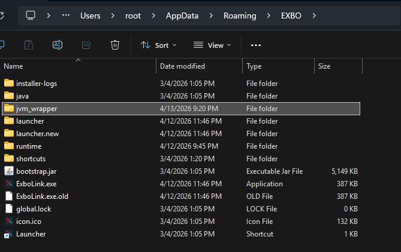

# Stalart JVM Wrapper

> [!WARNING]
> Данный проект является **неофициальной** утилитой, разработанной [nyrokume.dev](https://github.com/nyrokume-dev).
> Утилита **не аффилирована с gravity launcher**, однако была проверена [GloomyFolken](https://github.com/GloomyFolken)
> и классифицирована как безопасное ПО.

> [!CAUTION]
> Если вы столкнулись с проблемами после установки этой программы — **перейдите в [документ по устранению неполадок](./docs/TROUBLESHOOTING.md)** и найдите там свою ситуацию. Все типичные проблемы и способы их решения описаны пошагово.
>
> Пожалуйста, **не беспокойте этой утилитой ни модераторов gravity launcher, ни техническую поддержку игры**. Они такие же обычные люди, как и вы, и понятия не имеют, что именно происходит на вашем компьютере. Все инструкции уже есть в документе по ссылке выше — откройте его до того, как писать куда-либо.

**Утилита для модификации параметров запуска JVM и оптимизации её работы.**

**JVM (Java Virtual Machine)** — это среда выполнения, через которую работает [STALART: X](https://stalart.ru/).

Код игры исполняется не напрямую на системе, а внутри виртуальной машины Java. Во время работы она компилирует его
в машинный код под конкретный ПК (JIT-компиляция). Фактически это дополнительный слой между игрой и железом,
который отвечает за выполнение кода и его адаптацию под систему.

Данная программа позволяет изменить параметры запуска JVM для повышения производительности игры, используя как предустановленные,
так и пользовательские JSON-файлы конфигурации.

> [!IMPORTANT]
> Утилита подбирает параметры JVM под любой объём ОЗУ, начиная с 8 ГБ.
> На системах с меньшим объёмом `default.json` генерируется с минимально безопасным heap,
> но стабильной работы игры это не гарантирует — лучше увеличить оперативную память или
> использовать стандартные настройки лаунчера gravity launcher.

---

## Вносимые изменения

Утилита состоит из двух бинарников, лежащих в одной директории:

- **`cli.exe`** — интерактивное меню для установки, удаления и управления конфигурациями. Запускается пользователем только когда нужно что-то настроить.
- **`service.exe`** — тихий перехватчик, который Windows автоматически запускает при старте игры. Не имеет интерфейса, трогать вручную не нужно.

`service.exe` перехватывает запуск процесса игры `stalart.exe` (лаунчер) или `stalartw.exe` (Steam) для:

- **Подбора оптимальной конфигурации JVM:** объём выделенных ресурсов, режим работы GC (Garbage Collector) и JIT-компиляции.
- **Повышения приоритета процесса игры:** процесс выполняется приоритетнее по сравнению с другими процессами.

Утилита устанавливается **один раз** и автоматически запускается при каждом старте игры.

> [!IMPORTANT]
> Файлы игры при этом не затрагиваются и не модифицируются.
> Утилита также не вмешивается в работу процесса игры и не встраивается в него.

## Требования

- **Операционная система:** Windows 10/11
- **Версия игры:** Steam/Лаунчер/EGS/VK Play
- **Права ОС:** права администратора в Windows (нужны только для установки/удаления перехвата)
- **ЦП:** 4 и более ядер
- **ОЗУ:** 8+ ГБ, рекомендуется 12+ ГБ (иначе часть оптимизаций, например `PreTouch`, останется отключённой)

## Работа с утилитой

### Установка

> [!TIP]
> Самая частая ошибка при установке — положить `jvm_wrapper` куда-то глубоко внутрь `runtime/stalart/...`. Папка должна лежать **в корне директории gravity launcher**, рядом с `ExboLink.exe` и каталогом `runtime/`. Вот как это должно выглядеть:
>
> 

1. Добавьте папку с игрой в исключения Защитника Windows или другого Антивирусного ПО:
   - Пример для Steam: `C:\Program Files\Steam\steamapps\common\STALART`
   - Пример для Лаунчера: `C:\Users\User\AppData\Roaming\gravity launcher`
   - Пример для EGS: `C:\Games\EGS Stalart\STALART`
2. Создайте каталог `jvm_wrapper` в корне директории лаунчера (см. подсказку выше).
3. Скачайте [последнюю версию](../../releases/latest) и распакуйте `wrapper.zip` в папку `jvm_wrapper` — внутри должны оказаться `cli.exe`, `service.exe` и каталог `examples/`.
4. Запустите `cli.exe`, в открывшемся меню выберите пункт `Install` при помощи стрелок и нажмите **Enter**.
5. Появится UAC-запрос на права администратора — подтвердите его. Это нормально: установка перехвата IFEO пишется в `HKLM`, для чего требуются права администратора.

**Теперь можно запускать игру!**

> [!IMPORTANT]
> Несколько особенностей работы утилиты:
>
> - Аппаратный G-Sync может привести к артефактам изображения. Рекомендуется его выключить.
> - Утилита не распространяется на другие приложения, использующие JVM.
> - Для систем с объёмом ОЗУ не более 8-16 ГБ рекомендуется включить файл подкачки.

### Удаление

1. Запустите `cli.exe`, в открывшемся меню выберите пункт `Uninstall` при помощи стрелок и нажмите **Enter**.
2. Перейдите в папку с игрой.
3. Удалите папку `jvm_wrapper`.
4. Перезапустите игру, если она запущена.

### Конфигурация

После установки утилита автоматически создаст профиль конфигурации `default.json`,
который будет располагаться в папке `jvm_wrapper/configs/default.json`.
Именно с этим профилем игра будет запускаться по умолчанию.
Данный профиль будет адаптирован под параметры вашего компьютера, но его наличие не исключает возможность кастомной настройки.

**Конфигурация сохраняется в реестре Windows:** `HKCU\\Software\\StalcraftWrapper`.

Конфигурацию запуска можно менять самостоятельно. Для этого:

1. Запустите `cli.exe`, в открывшемся меню выберите пункт `Select Config` при помощи стрелок и нажмите **Enter**.
2. Выберите необходимый файл конфигурации и нажмите **Enter**.
3. Перезапустите игру, если она запущена.

> [!NOTE]
> По умолчанию утилита создает несколько готовых профилей:
> `compat.json`, `balanced.json`, `default.json`, `performance.json`, `ultra.json`.
> Полная таблица значений находится в [docs/PROFILES.md](./docs/PROFILES.md).

#### Примеры конфигурации

На данный момент в репозитории лежит дополнительный пример — `examples/8khz.json`, ориентированный на high-end системы (8+ ядер, 32 ГБ ОЗУ) с мышью 8 kHz. Он делает упор на минимальные STW-паузы и предсказуемый фреймтайм в ущерб небольшому throughput'у.

Чтобы использовать пример, перейдите в каталог репозитория [`/examples`](./examples/), скачайте интересующий `.json` и положите его в `jvm_wrapper/configs/`.

Запустите утилиту, выберите `Select Config` в меню. Теперь в списке, помимо `default.json`, должен появиться ещё один профиль конфигурации. Выберите его, после чего перезапустите игру.

#### Кастомная конфигурация

Для создания своего собственного профиля конфигурации достаточно скопировать файл `default.json`,
переименовать его, например, в `my_setup.json`, после чего отредактировать через любой доступный
текстовый редактор.

> [!CAUTION]
> Кастомная конфигурация рекомендуется только тем, кто **на 100% понимает**, что он делает.
> В противном случае вы рискуете нарушить не только стабильность JVM и, как следствие, игры, но
> и всей операционной системы.

Создание своей собственной конфигурации должно сопровождаться изучением [документации](./docs/PARAMS.md)
к параметрам конфигурации.

> [!TIP]
> Если вы описали кастомную конфигурацию в `default.json` и хотите вернуться
> к рекомендованным настройкам — выберите в меню пункт `Regenerate Config`.
> Данное действие запишет оптимальные настройки для вашего ПК в `default.json`.

---

## Дополнительно

### Логирование

Утилита пишет один структурированный лог-файл `jvm_wrapper/logs/wrapper.log` рядом с `cli.exe` и `service.exe`. В него попадают: запуск, детект железа, загрузка конфига, старт игрового процесса, код выхода. Путь пользователя редактируется до `<user>`, сырые аргументы лаунчера и JVM-флаги **не пишутся**. Файл усекается при превышении 2 МБ.

Если вы столкнулись с проблемой и хотите сообщить о ней — приложите этот файл к issue на GitHub. Он не содержит личной информации и безопасен для публикации.

### Large Pages

**Large Pages** — это режим работы виртуальной памяти, при котором используются страницы большего размера, чем стандартные 4 KB.

Включение Large Pages уменьшает накладные расходы на работу с памятью, как следствие делает GC и доступ к heap стабильнее и быстрее. Это происходит из-за того, что ЦП обращается к оперативной памяти не напрямую, а через TLB (Translation Lookaside Buffer) — чем меньше в нём промахов, тем выше пропускная способность.

> [!CAUTION]
> Large Pages закрепляют память за приложением и не позволяют системе перераспределять её.
> Неправильная настройка может привести к нестабильной работе ОС. Отдавайте отчёт своим действиям!
> Убедитесь, что выделенная память в профиле конфигурации не превышает 40%-50% от общего объёма ОЗУ,
> а общий запас ОЗУ 16+ ГБ.

Для того, чтобы включить Large Pages, следуйте следующим шагам:

1. Нажмите сочетание клавиш `Win` + `R`.
2. Введите `secpol.msc` и нажмите `Enter`.
3. Перейдите *Локальные политики → Назначение прав пользователя*.
4. Найдите политику *"Блокировка страниц в памяти"*.
5. Откройте политику двойным нажатием, добавьте своего пользователя или группу "Администраторы".
6. Примените изменения и перезагрузите ПК.

### Техническая информация

Подробную техническую информацию с описанием принципов работы утилиты,
а также инструкциями по сборке можно найти [здесь](./docs/OVERVIEW.md).
