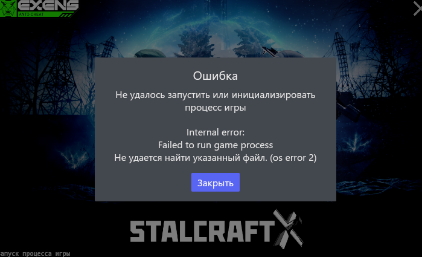
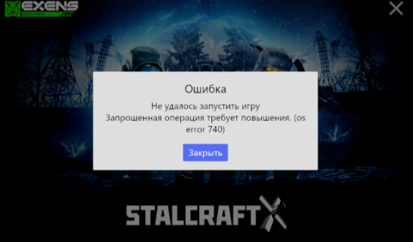
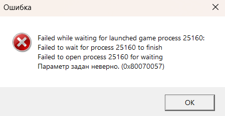

# Troubleshooting

If something went wrong while using the wrapper — find a matching issue in the sections below and follow the steps.

If your issue isn't listed here, open a GitHub issue and attach the files from `jvm_wrapper/logs/` (they do not contain personal data).

> [!WARNING]
> **For users on older versions.** In early releases the utility shipped as a single `wrapper.exe` binary that combined the roles of both `cli.exe` (menu and install) and `service.exe` (intercepting the game launch). If you're still on that version — anywhere below that mentions `cli.exe` **or** `service.exe`, read it as your `wrapper.exe`. The steps apply the same way, you just have one file instead of two.

---

## Anti-cheat errors

Errors shown by the game's anti-cheat at launch are usually a re-wrapping of ordinary system errors that happened while `service.exe` was starting. To resolve such an error, you don't fix the anti-cheat — you fix whatever is preventing it from launching the wrapper.

### `OS error 2` — The system cannot find the file specified

**What happened.** Windows tries to start `service.exe` but can't find it on disk. This usually means one of two things:

1. Your antivirus or Windows Defender deleted `service.exe` as suspicious.
2. You deleted the `jvm_wrapper` folder manually without first running `Uninstall` in `cli.exe`.

**How to fix.**

1. Download the [latest release](../../releases/latest) of `wrapper.zip` and extract it back into the folder where the wrapper used to live. After extraction `service.exe` should be sitting next to `cli.exe` again.
2. Then proceed based on your situation:
   - **If an antivirus deleted the file** — add the game folder to your antivirus exclusions (see [README → Installation](../README.en.md#installation)) and run `cli.exe` → `Install` again.
   - **If you removed the folder by hand** — run `cli.exe` → `Uninstall` first. Only then delete the `jvm_wrapper` folder. That's the correct way to remove the utility: it detaches the interception hook from the game, so Windows no longer tries to launch the deleted `service.exe`.

### `OS error 740` — The requested operation requires elevation

**What happened.** Someone — usually the user themselves, out of habit of "run everything as admin" — ticked the **"Run this program as an administrator"** checkbox in `service.exe`'s file properties. After that Windows asks for UAC elevation on every launch. But when the game launcher tries to start the game, there is nobody to show the UAC prompt to: the launcher runs as a regular user and cannot grant elevation to a child process. Windows returns error 740, the anti-cheat picks it up and surfaces it to the player.

> `service.exe` **must not** run as administrator. Only `cli.exe` needs admin rights during install/uninstall, and it requests them through a UAC prompt automatically when needed.

**How to fix.**

1. Open the `jvm_wrapper` folder, find `service.exe`, right-click it → **Properties**.
2. Go to the **Compatibility** tab.
3. Uncheck **"Run this program as an administrator"**.
4. If the checkbox is greyed out, click **"Change settings for all users"** and uncheck it there, then press **OK**.
5. While you're at it, check `cli.exe` too — if the checkbox is set, uncheck it as well. The wrapper asks for admin rights automatically only when they are actually needed.
6. Launch the game again.

---

## Optimization is not applied

This section covers the situation where the install completes without any errors, the game launches, but nothing feels different: FPS is unchanged, pauses are the same, memory usage looks identical to before.

### Install succeeded, but the game starts as if nothing changed

**How to confirm this is your case.**

The fastest indicator — **right before the game window appears, a small black console window flashes on screen for a second or two**. That's `service.exe` at work: it launches, reads the config, rewrites the JVM flags and spawns the game. If you see no console window at all when launching the game, the wrapper was never invoked and the game starts as if it wasn't installed.

A more precise check via Task Manager:

1. Launch the game and, without minimizing it, open **Task Manager** (`Ctrl + Shift + Esc`) → **Details** tab.
2. Find the `stalart.exe` process (launcher/EGS/VK Play) or `stalartw.exe` (Steam).
3. Check the **Memory** column.

Starting with version **1.1.0** the wrapper always produces a working `default.json` profile and allocates at least 2–4 GB of heap even on weak systems. On a machine with 16+ GB of RAM you should see `stalart.exe` / `stalartw.exe` using **6–8 GB**. If even on a strong PC the game is only using 2–4 GB, the JVM flags **were not applied** — the game launched with the stock launcher settings.

A third symptom of the same issue: the `jvm_wrapper/logs/` folder is **empty** or `wrapper.log` doesn't update when you launch the game. That means `service.exe` was never executed — Windows is not routing the game launch through the interception.

**Why it happens.**

The culprit is an aggressive antivirus — most commonly **360 Total Security**, sometimes Avast or similar "Total Security"-branded products from China. The IFEO mechanism that the wrapper relies on is a classic technique that malware uses to gain persistence, so these antivirus products **specifically** monitor writes to IFEO and block or revert them. And they do it:

- **Silently** — the user sees "Install successful", then a few seconds later the antivirus removes the registry entry in the background.
- **At the kernel driver level** — even when you click "pause protection" or "disable" in the antivirus UI, the driver keeps running and still blocks IFEO writes. The "disable" option in products like 360 Total Security only turns off the visible features; the critical protections stay active.

**How to fix.**

The only reliable fix is to **completely uninstall** the antivirus. Not disable, not pause, not add the wrapper to exclusions — actually remove it.

1. Open **Windows Settings** → **Apps** → **Installed apps** (or **Control Panel** → **Programs and Features**, whichever you prefer).
2. Find your antivirus (`360 Total Security`, `360 Internet Security`, `Tencent PC Manager` and the like).
3. Click **Uninstall** and follow the installer prompts. If the antivirus offers to "disable" instead of uninstall, refuse — pick the uninstall option.
4. **Reboot your computer** — this is mandatory, some drivers only unload after a reboot.
5. Run `cli.exe` and perform `Uninstall` → `Install` again to rewrite the IFEO entries from scratch.
6. Launch the game. A console window should now flash briefly on startup, and `stalart.exe` / `stalartw.exe` in Task Manager should be using noticeably more memory than before.

For protection after uninstalling, leave **Windows Defender** (the built-in Microsoft Defender) on. It's sufficient for modern Windows 10/11 and doesn't block IFEO writes. If Defender happens to flag `service.exe` as suspicious, add the `jvm_wrapper` folder to exclusions ([README → Installation](../README.en.md#installation)).

---

## Launcher messages

This section covers the messages that appear inside the launcher window (Stalart Launcher, Steam, EGS, etc.) and are related to how the wrapper plugs into the game launch.

### `Failed while waiting for launched game`

**What happened.** The launcher started `stalart.exe` / `stalartw.exe` and expected the game process to stay alive for the entire duration of your play session. But because of how the wrapper works (IFEO hook + launch via `NtCreateUserProcess`), the launcher "loses sight of" the game process shortly after it appears — `service.exe` detaches as soon as the game shows its first window. When you then close the game normally — via the in-game menu or the window close button — the launcher sees that as "the process disappeared unexpectedly" and shows this dialog.

**What to do.** Just click **OK** and dismiss the message. It's normal behavior, no action is required: the game launched, played and exited correctly. The launcher simply doesn't know how to track a process that was started through an IFEO hook.

> [!NOTE]
> If this message appears **after a normal exit from the game** (you closed it yourself via the in-game menu or Alt+F4) — ignore it, everything is working correctly.
>
> If this message appears **after the game actually crashed** (black screen, hard freeze, dropped to the desktop with no exit dialog) — the dialog itself is unrelated, the launcher shows it either way. Something else crashed: either your configuration profile doesn't suit your hardware, or the wrapper is fundamentally incompatible with your system.

**If the game is actually crashing.**

1. Try **Regenerate Config** in the `cli.exe` menu — it rebuilds `default.json` for the current hardware, in case the old config is stale or no longer matches a PC upgrade.
2. If that helped — keep playing, the problem is solved.
3. If it didn't help — temporarily remove the wrapper (`cli.exe` → `Uninstall`) and play without it. If the crashes go away without the wrapper, the problem is compatibility with your hardware or Windows build — open an issue on GitHub and attach `jvm_wrapper/logs/wrapper.log`.
4. If the crashes persist without the wrapper, the wrapper isn't the cause — it's the game itself, your drivers, or the hardware.

---

## Overlay compatibility

This section covers third-party programs that draw their own UI on top of the game window — external crosshair overlays (HudSight), Steam Overlay, Discord Overlay, MSI Afterburner OSD and the like.

### HudSight / Steam Overlay not working

**Symptoms.** The overlay is running, configured, and works fine with other games, but draws nothing on top of Stalart: Steam Overlay won't open on `Shift + Tab`, HudSight doesn't show the crosshair, Discord doesn't highlight speakers.

**What we know.**

- This affects roughly **one user in ten** — not everyone, not always. For the majority overlays keep working alongside the wrapper without any special setup.
- The issue is **non-deterministic**: with the same overlay at the same version, it works for one player and not for another, and we have not found an obvious pattern.
- Every attempt to reproduce it on a test bench yields random results. No config change, PC restart, wrapper reinstall, or overlay reinstall reliably fixes it.

**No known fix.** We can't promise that a specific setting will resolve the overlay specifically in your case. For those affected, only workarounds remain:

1. **Play without the affected overlay.** If HudSight or Steam Overlay is essential but doesn't work with the wrapper, you have to choose — either the JVM optimization, or the overlay.
2. **Temporarily uninstall the wrapper** via `cli.exe` → `Uninstall` when you need the overlay (for example before a stream using Steam Overlay). Re-run `Install` afterwards.